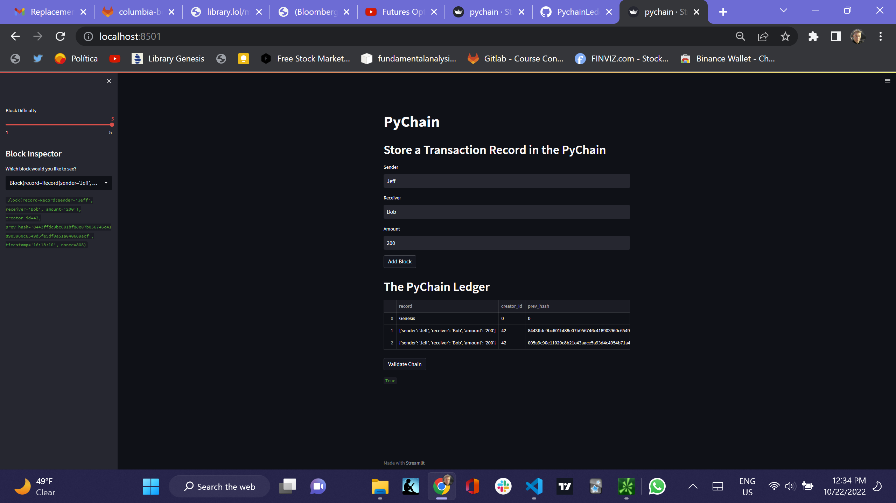

# Module_18_Challenge

# PyChain Ledger

################################################################################

I am fintech engineer working at one of the five largest banks in the world. I was recently promoted to act as the lead developer on their decentralized finance team. My task is to build a blockchain-based ledger system, complete with a user-friendly web interface. This ledger should allow partner banks to conduct financial transactions (that is, to transfer money between senders and receivers) and to verify the integrity of the data in the ledger.

I’ll make the following updates to the provided Python file for this Challenge, which already contains the basic PyChain ledger structure that you created throughout the module:

I will create a new data class named Record. This class will serve as the blueprint for the financial transaction records that the blocks of the ledger will store.

I will change the existing Block data class by replacing the generic data attribute with a record attribute that’s of type Record.

I will create additional user input areas in the Streamlit application. These input areas should collect the relevant information for each financial record that I’ll store in the PyChain ledger.

Finally, I will complete PyChain ledger.

# In more detail, I will do the following:

Step 1: Create a Record Data Class

- Create a new data class named `Record`. This class will serve as the
- blueprint for the financial transaction records that the blocks of the ledger that it will store.

Step 2: Modify the Existing Block Data Class to Store Record Data

- Change the existing `Block` data class by replacing the generic `data` attribute with a `record` attribute that’s of type `Record`.

# Step 3: Add Relevant User Inputs to the Streamlit Interface

- Create additional user input areas in the Streamlit application. These input areas should collect the relevant information for each financial recor that you’ll store in the `PyChain` ledger.

# Step 4: Test the PyChain Ledger by Storing Records

- Test your complete `PyChain` ledger.

################################################################################

## Technologies

I created it in Anaconda with a dev environment running 3.7.13. Pip install the following libraries and dependencies.

---

## Installation Guide

pip install streamlit
pip install dataclasses
pip install typing
pip install datetime
pip install pandas
pip install hashlib

git clone https://github.com/JeffSmith-ok/Module_18_Challenge

cd Module_18_Challenge

---

## Usage

The following images present the first notebook.

##  </br>

---

## Contributors

This is the Module 18 Challenge.

My contact information is:

Name: Jeffrey M. Smith </br>
Linkedin: https://www.linkedin.com/in/jeffsmith77/ </br>
Personal email: jsmith@lexsmith.finance</br>

---

## License

MIT License

Copyright (c) 2022 Jeffrey M. Smith

Permission is hereby granted, free of charge, to any person obtaining a copy of this software and associated documentation files (the "Software"), to deal in the Software without restriction, including without limitation the rights to use, copy, modify, merge, publish, distribute, sublicense, and/or sell
copies of the Software, and to permit persons to whom the Software is furnished to do so, subject to the following conditions:

The above copyright notice and this permission notice shall be included in all copies or substantial portions of the Software.

THE SOFTWARE IS PROVIDED "AS IS", WITHOUT WARRANTY OF ANY KIND, EXPRESS OR IMPLIED, INCLUDING BUT NOT LIMITED TO THE WARRANTIES OF MERCHANTABILITY, FITNESS FOR A PARTICULAR PURPOSE AND NONINFRINGEMENT. IN NO EVENT SHALL THE AUTHORS OR COPYRIGHT HOLDERS BE LIABLE FOR ANY CLAIM, DAMAGES OR OTHER LIABILITY, WHETHER IN AN ACTION OF CONTRACT, TORT OR OTHERWISE, ARISING FROM, OUT OF OR IN CONNECTION WITH THE SOFTWARE OR THE USE OR OTHER DEALINGS IN THE
SOFTWARE.

```

```
